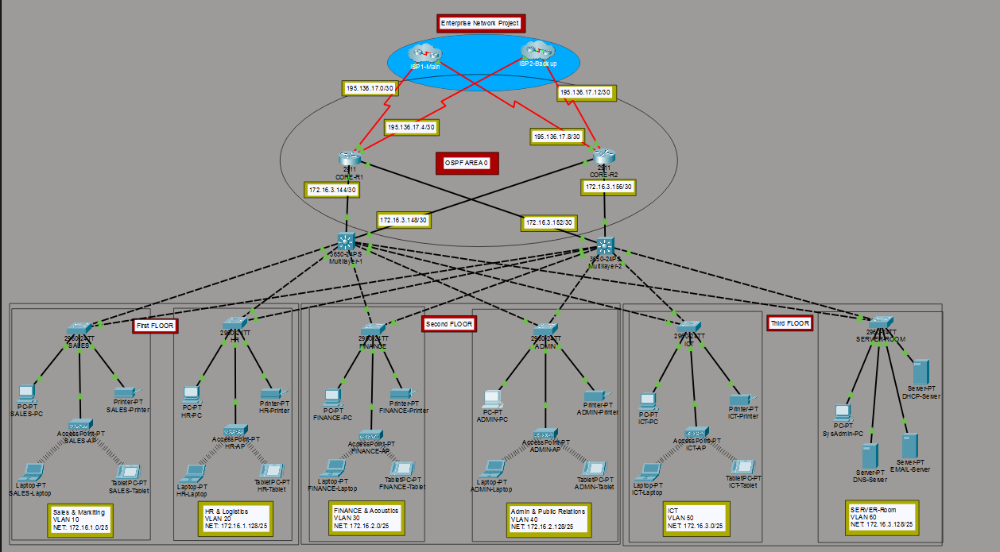
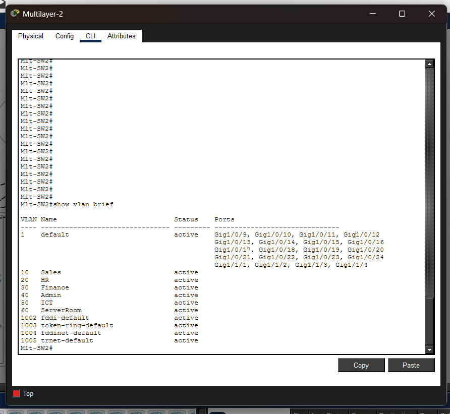
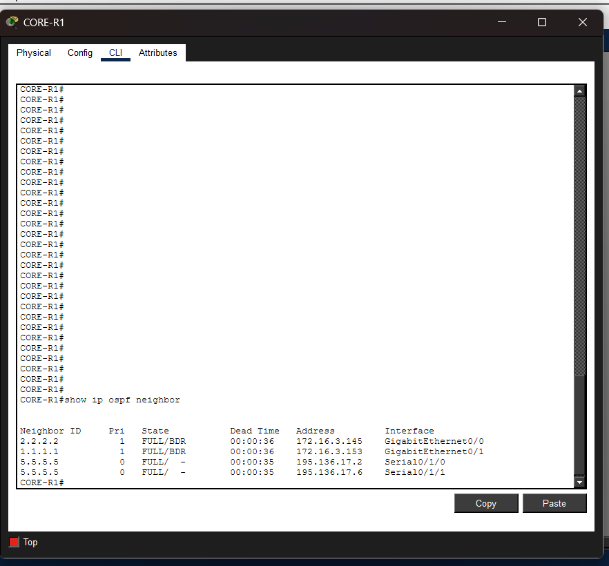
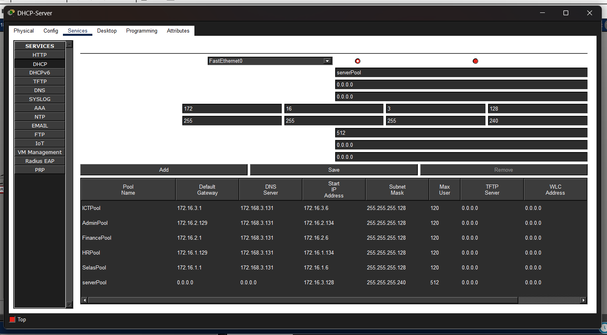
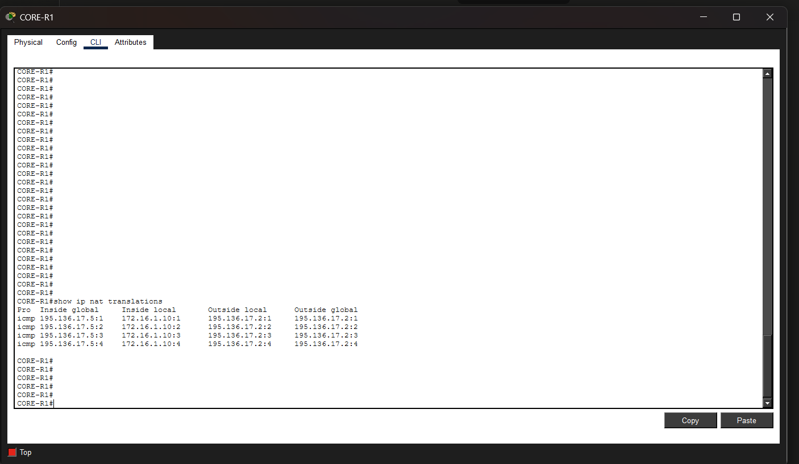
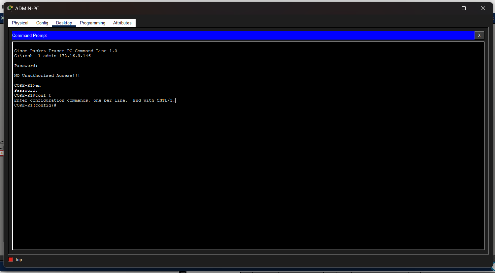

# Enterprise Campus Network Design

## 📌 Project Overview

This project is a complete Enterprise Campus Network design built using Cisco Packet Tracer.  

It simulates a real-world multi-floor organization network supporting multiple departments with scalability, redundancy, and security.

The network follows a hierarchical design model and integrates key enterprise networking technologies such as VLANs, routing protocols, DHCP, NAT, and security mechanisms.

---
## Notes
This is a test update.

## 🏢 Network Scenario

The organization consists of a 3-floor building:

### First Floor:

- Sales & Marketing Department (120 users)
- Human Resources & Logistics (120 users)

### Second Floor:

- Finance & Accounts Department (120 users)
- Administration & Public Relations (120 users)

### Third Floor:

- ICT Department (120 users)
- Server Room (12 devices)

---

## ⚙️ Technologies Implemented

- Hierarchical Network Design (Core, Distribution, Access)
- VLAN Segmentation for each department
- Inter-VLAN Routing using Layer 3 Switches
- DHCP for Dynamic IP Address Allocation
- OSPF Dynamic Routing Protocol
- NAT/PAT for Internet Access
- Access Control Lists (ACLs)
- SSH Secure Remote Management
- Wireless Network Connectivity
- Redundant Routers and Multilayer Switches

---

## 🌐 IP Addressing

Base Network: `172.16.0.0/16`

Each department is assigned a dedicated subnet to ensure:
- Proper segmentation
- Efficient IP utilization
- Improved network performance and security

---

## 🔁 Routing Protocol
OSPF (Open Shortest Path First) was implemented to enable dynamic routing between all routers and multilayer switches, ensuring:
- Fast convergence
- Redundancy
- Scalable routing architecture

---

## 🔐 Security Features
- SSH enabled for secure remote device access
- Port Security applied on sensitive departments (Finance)
- ACLs configured to control inter-department traffic
- NAT/PAT configured for secure internet access

---

## 🖧 Network Features
- Full VLAN-based segmentation
- Inter-VLAN communication via Layer 3 switching
- Centralized DHCP server
- Internet connectivity using NAT Overload
- Redundant network paths for high availability

---

## 📷 Screenshots

### 🔹 Network Topology

### 🔹 VLAN Configuration

### 🔹 OSPF Neighbors

### 🔹 DHCP Allocation

### 🔹 NAT / PAT Translation

### 🔹 SSH Remote Access

---

## 🛠️ Tools Used

- Cisco Packet Tracer

---

## 📌 Skills Demonstrated

- Enterprise Network Design
- Routing & Switching
- Network Security Implementation
- VLAN & Subnetting Design
- Troubleshooting & Verification
- Infrastructure Planning

---

## 🚀 Project Status

✔ Fully designed and implemented  
✔ All services tested and verified  
✔ End-to-end connectivity confirmed  

---

## 👨‍💻 Author

Hussein Ibrhaem 

🔗 LinkedIn Profile: [Hussein Ibrahem] ( https://www.linkedin.com/in/hussein-ibrahem5/ )
